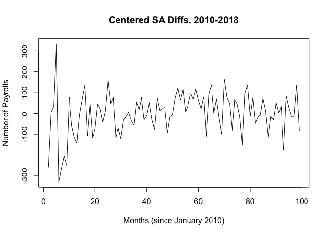
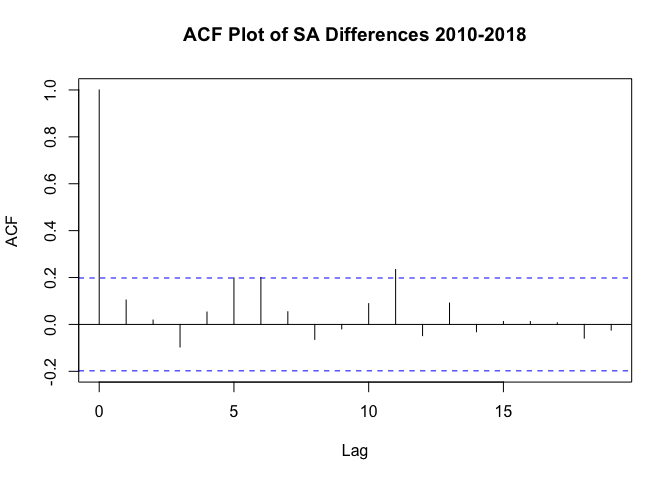
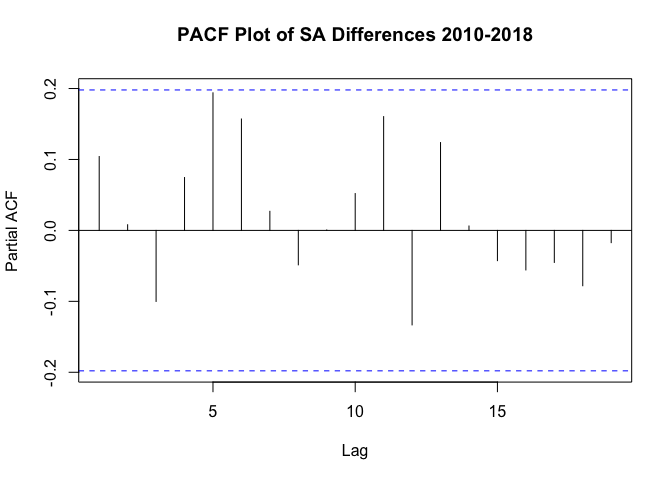
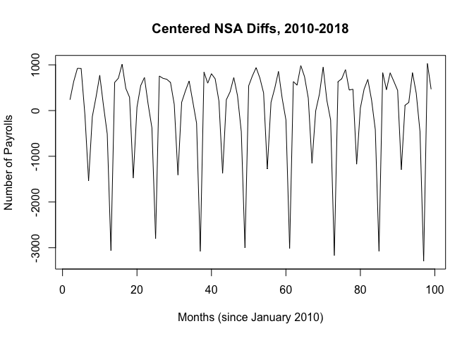
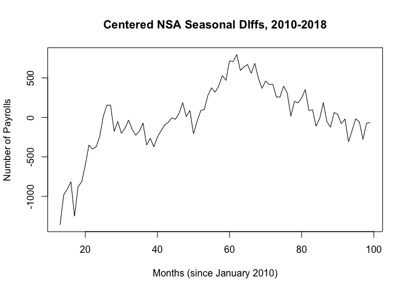
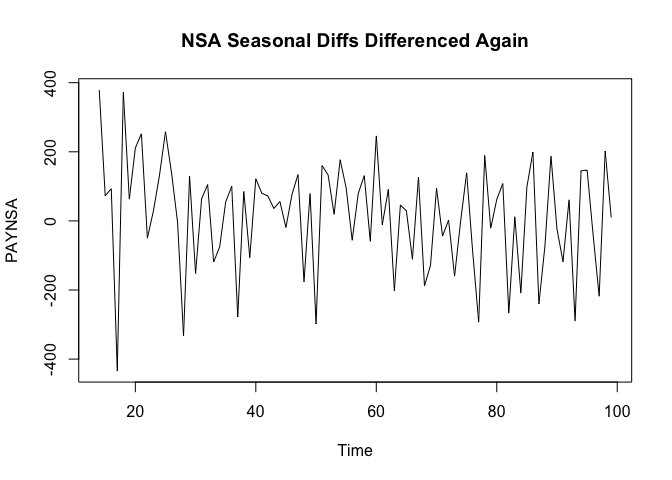
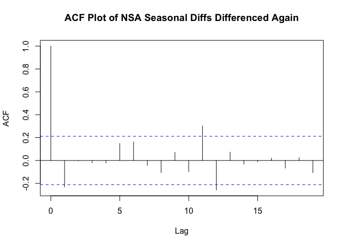
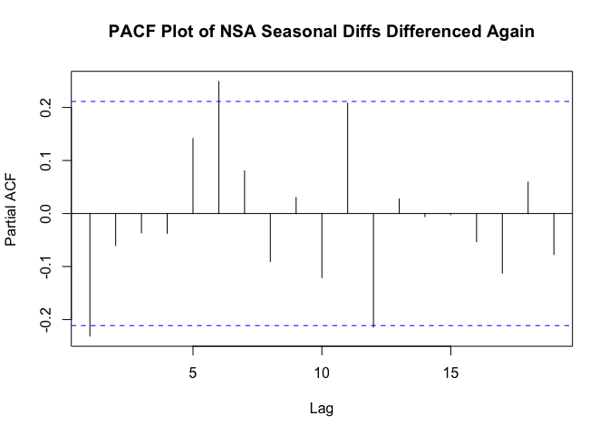
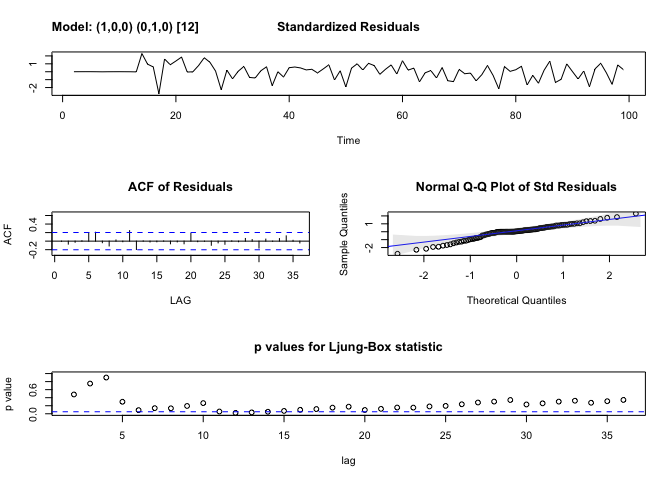
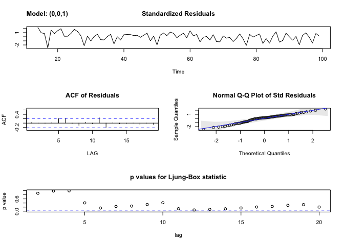

## ARIMA

We will use the Box-Jenkins method to build an ARIMA model for the seasonally adjusted and non-seasonally adjusted NFP data.

### Model identification for SA data


```r
PAYEMS <- read.csv(file = "PAYEMS.csv", header = TRUE, sep = ",")
nfp_sa_ts_2010_2018 <- ts(PAYEMS[853:951, ][2])
SA_diff <- diff(nfp_sa_ts_2010_2018, lag = 1, differences = 1)

SA_mean <- mean(SA_diff, na.rm = TRUE)
centered_SA_diff <- SA_diff - SA_mean
plot.ts(centered_SA_diff, main = "Centered SA Diffs, 2010-2018", xlab = "Months (since January 2010)", ylab = "Number of Payrolls")
```

<!-- -->

After differencing and mean centering, the time series appears stationary with a mean of approximately 188. There appear to be no trends.


```r
acf(centered_SA_diff, main = "ACF Plot of SA Differences 2010-2018")
```

<!-- -->

The ACF is always insignificant.


```r
pacf(centered_SA_diff, main = "PACF Plot of SA Differences 2010-2018")
```

<!-- -->


### Model identification for NSA data


```r
PAYNSA <- read.csv(file = "PAYNSA.csv", header = TRUE, sep = ",")
nfp_nsa_ts <- ts(PAYNSA[853:951,][2])
NSA_diff <- diff(nfp_nsa_ts, lag = 1, differences = 1)

NSA_mean <- mean(NSA_diff, na.rm = TRUE)
centered_NSA_diff <- NSA_diff - NSA_mean
plot.ts(centered_NSA_diff, main = "Centered NSA Diffs, 2010-2018", xlab = "Months (since January 2010)", ylab = "Number of Payrolls")
```

<!-- -->

```r
NSA_sdiff <- diff(nfp_nsa_ts, lag = 12, differences = 1)
NSA_smean <- mean(NSA_sdiff)
centered_NSA_sdiff <- NSA_sdiff - NSA_smean
plot.ts(centered_NSA_sdiff, main = "Centered NSA Seasonal DIffs, 2010-2018", xlab = "Months (since January 2010)", ylab = "Number of Payrolls")
```

<!-- -->

```r
NSA_sdiff2 <- diff(NSA_sdiff, lag = 1, differences = 1)
plot.ts(NSA_sdiff2, main = "NSA Seasonal Diffs Differenced Again")
```

<!-- -->

It appears that after seasonal differencing with seasonal period of 12 months then differencing again, the transformed time series closely resembles white noise.


```r
# acf(centered_NSA_diff, main = "ACF Plot of NSA Differences 2010-2018")
# acf(centered_NSA_sdiff, main = "ACF Plot of NSA Seasonal Differences 2010-2018")
acf(NSA_sdiff2, main = "ACF Plot of NSA Seasonal Diffs Differenced Again")
```

<!-- -->

The ACF does not appear to be significant at any lag.


```r
# pacf(centered_NSA_diff, main = "PACF Plot of NSA Differences 2010-2018")
# pacf(centered_NSA_sdiff, main = "PACF Plot of NSA Seasonal Differences 2010-2018")
pacf(NSA_sdiff2, main = "PACF Plot of NSA Seasonal Diffs Differenced Again")
```

<!-- -->

The PACF also does not appear to be significant at any lag.

The insignificant ACF and PACF for all lag values further supports the notion that our transformed time series is very close to white noise.


### Parameter Estimation and Model Diagnostics


```r
## First Difference
sarima(centered_NSA_diff, p = 1, d = 0, q = 0, D = 1, S = 12)
```

```
## initial  value 5.040918 
## iter   2 value 5.011460
## iter   3 value 5.011304
## iter   4 value 5.011213
## iter   5 value 5.011210
## iter   6 value 5.011209
## iter   6 value 5.011209
## final  value 5.011209 
## converged
## initial  value 5.037980 
## iter   2 value 5.037862
## iter   3 value 5.037676
## iter   4 value 5.037676
## iter   4 value 5.037676
## iter   4 value 5.037676
## final  value 5.037676 
## converged
```

<!-- -->

```
## $fit
## 
## Call:
## stats::arima(x = xdata, order = c(p, d, q), seasonal = list(order = c(P, D, 
##     Q), period = S), xreg = constant, optim.control = list(trace = trc, REPORT = 1, 
##     reltol = tol))
## 
## Coefficients:
##           ar1  constant
##       -0.2434    1.1874
## s.e.   0.1074    1.1162
## 
## sigma^2 estimated as 23733:  log likelihood = -555.27,  aic = 1116.54
## 
## $degrees_of_freedom
## [1] 84
## 
## $ttable
##          Estimate     SE t.value p.value
## ar1       -0.2434 0.1074 -2.2664  0.0260
## constant   1.1874 1.1162  1.0638  0.2905
## 
## $AIC
## [1] 11.11546
## 
## $AICc
## [1] 11.13847
## 
## $BIC
## [1] 10.16821
```

```r
## Seasonal Diff then Differenced Again
sarima(NSA_sdiff2, p = 0, d = 0, q = 1)
```

```
## initial  value 5.066643 
## iter   2 value 5.037155
## iter   3 value 5.037005
## iter   4 value 5.036966
## iter   5 value 5.036958
## iter   6 value 5.036957
## iter   6 value 5.036957
## final  value 5.036957 
## converged
## initial  value 5.034996 
## iter   2 value 5.034841
## iter   3 value 5.034840
## iter   4 value 5.034840
## iter   4 value 5.034840
## iter   4 value 5.034840
## final  value 5.034840 
## converged
```

<!-- -->

```
## $fit
## 
## Call:
## stats::arima(x = xdata, order = c(p, d, q), seasonal = list(order = c(P, D, 
##     Q), period = S), xreg = xmean, include.mean = FALSE, optim.control = list(trace = trc, 
##     REPORT = 1, reltol = tol))
## 
## Coefficients:
##           ma1    xmean
##       -0.2665  13.8001
## s.e.   0.1066  12.2134
## 
## sigma^2 estimated as 23596:  log likelihood = -555.02,  aic = 1116.05
## 
## $degrees_of_freedom
## [1] 84
## 
## $ttable
##       Estimate      SE t.value p.value
## ma1    -0.2665  0.1066 -2.5007  0.0143
## xmean  13.8001 12.2134  1.1299  0.2617
## 
## $AIC
## [1] 11.11533
## 
## $AICc
## [1] 11.14199
## 
## $BIC
## [1] 10.17241
```

AIC values are similar for all orders after model fitting.

Because our transformed time series so closely resembles white noise, it is essentially ARMA(0, 0) and fitting any non-zero order ARMA model does not have any predictive properties. Therefore, instead of fitting an ARMA model we turn to spectral analysis to analyze the seasonal variation of our time series from a frequency perspective.
