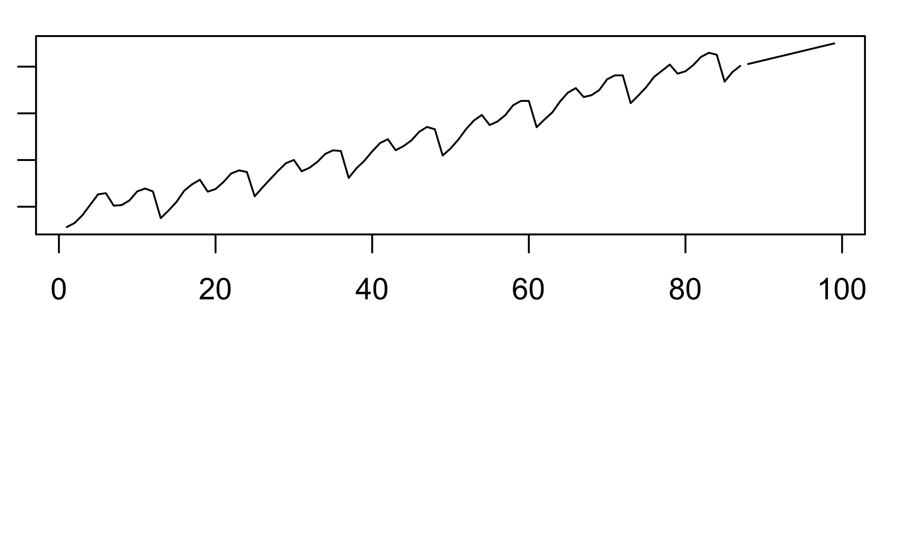
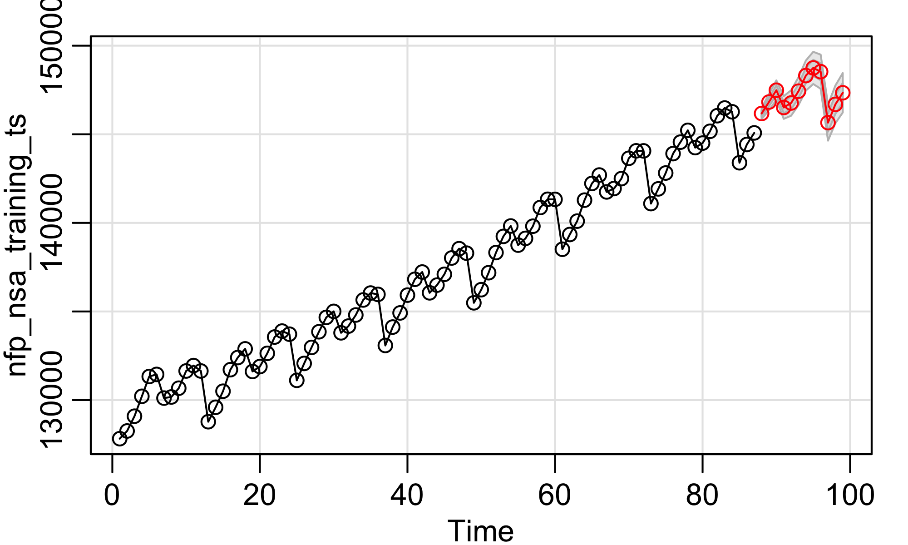

# Project NFP - Forecasting
Sam Choi, Eric Xu  
<!-- Don't edit in between this line and the one below -->

*Source file* 
<a href='data:text/x-markdown;base64,LS0tCnRpdGxlOiAiUHJvamVjdCBORlAgLSBGb3JlY2FzdGluZyIKYXV0aG9yOiAiU2FtIENob2ksIEVyaWMgWHUiCm91dHB1dDoKICBodG1sX2RvY3VtZW50OgogICAgZmlnX2hlaWdodDogMwogICAgZmlnX3dpZHRoOiA1CiAgICBrZWVwX21kOiB0cnVlCi0tLQo8IS0tIERvbid0IGVkaXQgaW4gYmV0d2VlbiB0aGlzIGxpbmUgYW5kIHRoZSBvbmUgYmVsb3cgLS0+CmBgYHtyIGluY2x1ZGU9RkFMU0V9CmxpYnJhcnkoRGF0YUNvbXB1dGluZykKbGlicmFyeShhc3RzYSkKYGBgCipTb3VyY2UgZmlsZSogCmBgYHtyLCByZXN1bHRzPSdhc2lzJywgZWNobz1GQUxTRX0KaW5jbHVkZVNvdXJjZURvY3VtZW50cygpCmBgYAoKIyMjIyBPYmplY3RpdmUKVXNpbmcgZGF0YSBmcm9tIEphbnVhcnkgMjAxMCB0byBNYXJjaCAyMDE3LCB3ZSBhaW0gdG8gZm9yZWNhc3QgTm9uZmFybSBwYXlyb2xscyBmb3IgdGhlIGZvbGxvd2luZyAxMiBtb250aHMgKEFwcmlsIDIwMTcgdG8gTWFyY2ggMjAxOCkuICAKPGJyPgoKIyMjIyBTQSAoUEFZRU1TKSBhbmQgTlNBIChQQVlOU0EpIE5GUCBEYXRhCmBgYHtyfQpQQVlFTVMgPC0gcmVhZC5jc3YoZmlsZSA9ICJQQVlFTVMuY3N2IiwgaGVhZGVyID0gVFJVRSwgc2VwID0gIiwiKQpQQVlOU0EgPC0gcmVhZC5jc3YoZmlsZSA9ICJQQVlOU0EuY3N2IiwgaGVhZGVyID0gVFJVRSwgc2VwID0gIiwiKQpuZnBfc2FfdHMgPC0gdHMoUEFZRU1TWzJdKQpuZnBfbnNhX3RzIDwtIHRzKFBBWU5TQVsyXSkKYGBgCgojIyMjIFNwbGl0dGluZyB0aGUgZGF0YXNldApUcmFpbmluZzogSmFudWFyeSAyMDEwIC0gTWFyY2ggMjAxNyAgClRlc3Rpbmc6IEFwcmlsIDIwMTcgLSBNYXJjaCAyMDE4ICAKYGBge3J9Cm5mcF9zYV90cmFpbmluZ190cyA8LSB0cyhQQVlFTVNbODUzOjkzOSxdWzJdKQpuZnBfc2FfdGVzdGluZ190cyA8LSB0cyhQQVlFTVNbOTQwOjk1MSxdWzJdKQpuZnBfbnNhX3RyYWluaW5nX3RzIDwtIHRzKFBBWU5TQVs4NTM6OTM5LF1bMl0pCm5mcF9uc2FfdGVzdGluZ190cyA8LSB0cyhQQVlOU0FbOTQwOjk1MSxdWzJdKQpgYGAKCiMjIyMgRm9yZWNhc3QgUGVyZm9ybWFuY2UKR2VuZXJhdGUgQVJJTUEgZm9yZWNhc3RzIGFuZCBtZWFzdXJlIGFjY3VyYWN5IGJ5IGNhbGN1bGF0aW5nIG1lYW4tc3F1YXJlZCBlcnJvcnMKCmBgYHtyIG91dC53aWR0aCA9ICI3MCUiLCBkcGkgPSA0MDB9CnBhcihtYXI9YygxLDEsMSwxKSkKbm9icyA8LSBsZW5ndGgobmZwX25zYV90cmFpbmluZ190cykKZml0IDwtIGFyaW1hKG5mcF9uc2FfdHJhaW5pbmdfdHMsIG9yZGVyPWMoMCwgMSwgMCksIHhyZWc9MTpub2JzKQpuX3ByZWQgPC0gbGVuZ3RoKG5mcF9uc2FfdGVzdGluZ190cykKZm9yZWNhc3QgPC0gcHJlZGljdChmaXQsIG5fcHJlZCwgbmV3eHJlZz0obm9icysxKToobm9icytuX3ByZWQpKQpwYXIobWZyb3c9YygyLDEpKQp0cy5wbG90KG5mcF9uc2FfdHJhaW5pbmdfdHMsIGZvcmVjYXN0JHByZWQpCmBgYAoKCk1lYW4tc3F1YXJlZCBlcnJvciBmdW5jdGlvbgpgYGB7cn0KbXNlIDwtIGZ1bmN0aW9uKHRzMSwgdHMyKSB7CiAgc3VtX3NxdWFyZXMgPSAwCiAgZm9yIChpIGluIDE6bGVuZ3RoKHRzMSkpIHsKICAgIGRpZmYgPC0gdHMxW2ldIC0gdHMyW2ldCiAgICBzdW1fc3F1YXJlcyA9IHN1bV9zcXVhcmVzICsgZGlmZl4yCiAgfQogIHN1bV9zcXVhcmVzL2xlbmd0aCh0czEpCn0KCmBgYAoKYGBge3J9Cm1zZShmb3JlY2FzdCRwcmVkLCBuZnBfbnNhX3Rlc3RpbmdfdHMpCmBgYAoKYGBge3Igb3V0LndpZHRoID0gIjcwJSIsIGRwaSA9IDQwMH0KcGFyKG1hcj1jKDEsMSwxLDEpKQpzZml0IDwtIHNhcmltYS5mb3IobmZwX25zYV90cmFpbmluZ190cywgbl9wcmVkLCBwPTAsIGQ9MSwgcT0wLCBQPTAsIEQ9MSwgUT0wLCBTPTEyKQpgYGAKCmBgYHtyfQpzZml0Cm1zZShzZml0JHByZWQsIG5mcF9uc2FfdGVzdGluZ190cykKYGBgCgoKCgoKCgoK' target='_blank' title='User  at /Users/samchoi' download='project-nfp-forecasting.Rmd'> &#8658; project-nfp-forecasting.Rmd</a>  

#### Objective
Using data from January 2010 to March 2017, we aim to forecast Nonfarm payrolls for the following 12 months (April 2017 to March 2018).  
<br>

#### SA (PAYEMS) and NSA (PAYNSA) NFP Data

```r
PAYEMS <- read.csv(file = "PAYEMS.csv", header = TRUE, sep = ",")
PAYNSA <- read.csv(file = "PAYNSA.csv", header = TRUE, sep = ",")
nfp_sa_ts <- ts(PAYEMS[2])
nfp_nsa_ts <- ts(PAYNSA[2])
```

#### Splitting the dataset
Training: January 2010 - March 2017  
Testing: April 2017 - March 2018  

```r
nfp_sa_training_ts <- ts(PAYEMS[853:939,][2])
nfp_sa_testing_ts <- ts(PAYEMS[940:951,][2])
nfp_nsa_training_ts <- ts(PAYNSA[853:939,][2])
nfp_nsa_testing_ts <- ts(PAYNSA[940:951,][2])
```

#### Forecast Performance
Generate ARIMA forecasts and measure accuracy by calculating mean-squared errors


```r
par(mar=c(1,1,1,1))
nobs <- length(nfp_nsa_training_ts)
fit <- arima(nfp_nsa_training_ts, order=c(0, 1, 0), xreg=1:nobs)
n_pred <- length(nfp_nsa_testing_ts)
forecast <- predict(fit, n_pred, newxreg=(nobs+1):(nobs+n_pred))
par(mfrow=c(2,1))
ts.plot(nfp_nsa_training_ts, forecast$pred)
```




Mean-squared error function

```r
mse <- function(ts1, ts2) {
  sum_squares = 0
  for (i in 1:length(ts1)) {
    diff <- ts1[i] - ts2[i]
    sum_squares = sum_squares + diff^2
  }
  sum_squares/length(ts1)
}
```


```r
mse(forecast$pred, nfp_nsa_testing_ts)
```

```
## [1] 1774426
```


```r
par(mar=c(1,1,1,1))
sfit <- sarima.for(nfp_nsa_training_ts, n_pred, p=0, d=1, q=0, P=0, D=1, Q=0, S=12)
```




```r
sfit
```

```
## $pred
## Time Series:
## Start = 88 
## End = 99 
## Frequency = 1 
##  [1] 146173 146821 147486 146512 146766 147432 148313 148746 148534 145657
## [11] 146687 147342
## 
## $se
## Time Series:
## Start = 88 
## End = 99 
## Frequency = 1 
##  [1] 160.5857 227.1024 278.1425 321.1713 359.0805 393.3529 424.8697
##  [8] 454.2049 481.7570 507.8165 532.6024 556.2851
```

```r
mse(sfit$pred, nfp_nsa_testing_ts)
```

```
## [1] 13108.25
```


