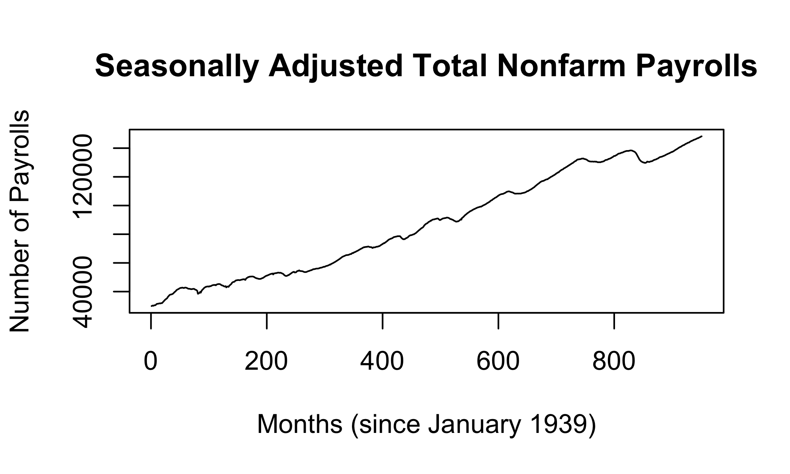
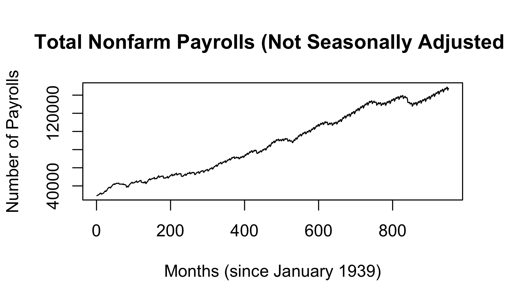
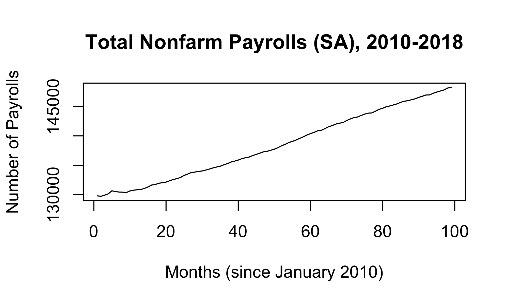
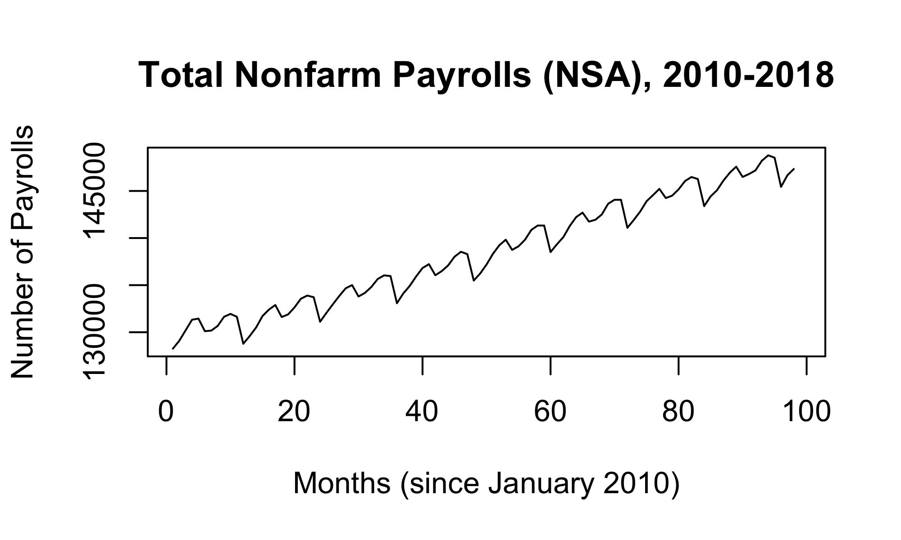
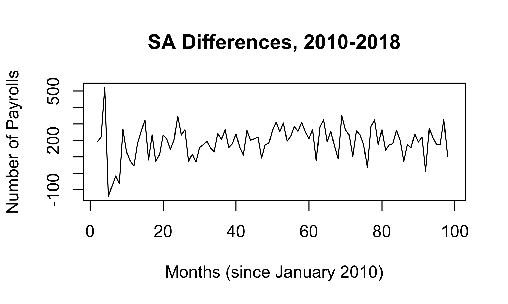
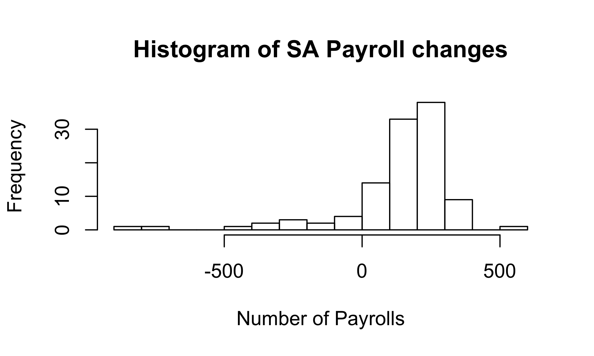
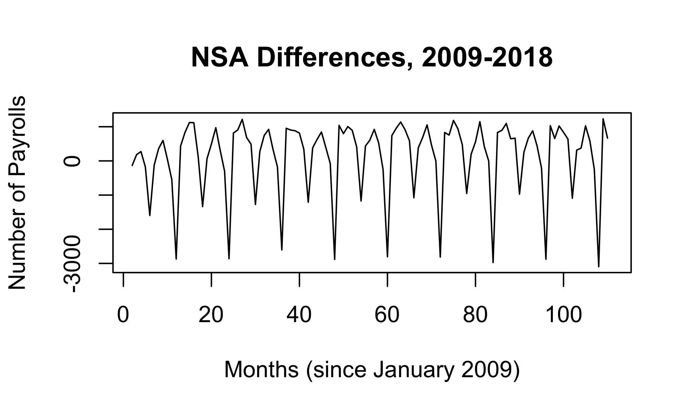
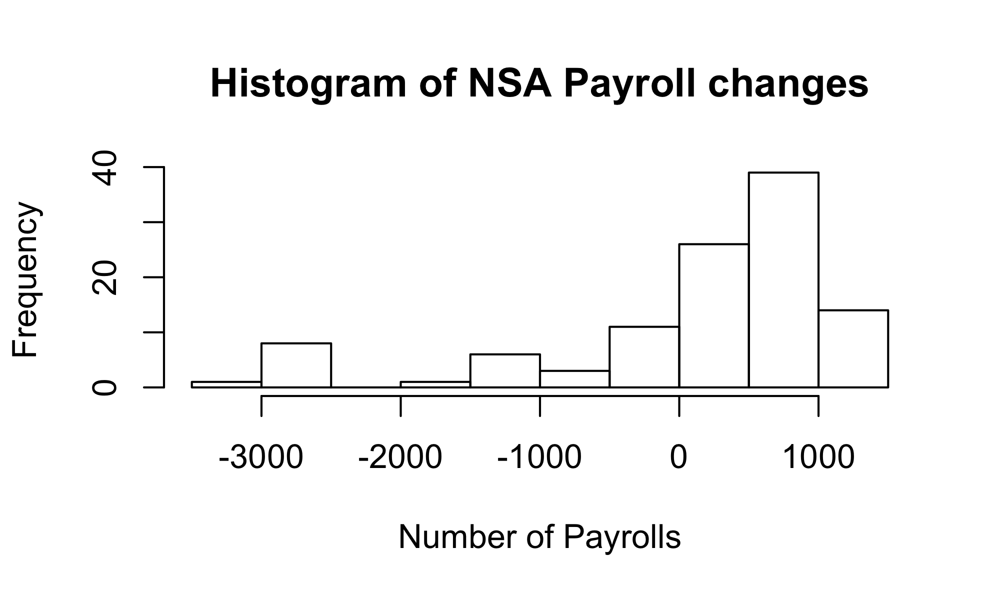

# Project NFP
Sam Choi, Eric Xu  
<!-- Don't edit in between this line and the one below -->

*Source file* 
<a href='data:text/x-markdown;base64,LS0tCnRpdGxlOiAiUHJvamVjdCBORlAiCmF1dGhvcjogIlNhbSBDaG9pLCBFcmljIFh1IgpvdXRwdXQ6CiAgaHRtbF9kb2N1bWVudDoKICAgIGZpZ19oZWlnaHQ6IDMKICAgIGZpZ193aWR0aDogNQogICAga2VlcF9tZDogdHJ1ZQogIHBkZl9kb2N1bWVudDogZGVmYXVsdAogIHdvcmRfZG9jdW1lbnQ6IGRlZmF1bHQKLS0tCjwhLS0gRG9uJ3QgZWRpdCBpbiBiZXR3ZWVuIHRoaXMgbGluZSBhbmQgdGhlIG9uZSBiZWxvdyAtLT4KYGBge3IgaW5jbHVkZT1GQUxTRX0KIyBEb24ndCBkZWxldGUgdGhpcyBjaHVuayBpZiB5b3UgYXJlIHVzaW5nIHRoZSBEYXRhQ29tcHV0aW5nIHBhY2thZ2UKbGlicmFyeShEYXRhQ29tcHV0aW5nKQpsaWJyYXJ5KGFzdHNhKQpgYGAKKlNvdXJjZSBmaWxlKiAKYGBge3IsIHJlc3VsdHM9J2FzaXMnLCBlY2hvPUZBTFNFfQppbmNsdWRlU291cmNlRG9jdW1lbnRzKCkKYGBgCgojIyMgTkZQIEVEQQpXZSBhaW0gdG8gZXhwbG9yZSB0d28gdmVyc2lvbnMgb2YgTkZQIGRhdGE6IFBBWUVNUyBhbmQgUEFZTlNBLiBQQVlFTVMgaXMgYSBkYXRhc2V0IHdpdGggc2Vhc29uYWxseSBhZGp1c3RlZCB2YWx1ZXMsIGFuZCBQQVlOU0EgaXMgYSBkYXRhc2V0IHdpdGhvdXQgc2Vhc29uYWwgYWRqdXN0bWVudHMuIFRoZSBkYXRhIGlzIHJlY29yZGVkIGluIHRob3VzYW5kcyBvZiBwZXJzb25zIChqb2JzIGNyZWF0ZWQpLiBUaGUgZGF0YXNldHMgY29udGFpbiBtb250aGx5IE5GUCByZXBvcnQgdmFsdWVzIGZyb20gSmFudWFyeSAxOTM5IHRvIE1hcmNoIDIwMTguICAKPGJyPgoKCiMjIyMgU2Vhc29uYWxseSBBZGp1c3RlZCAoUEFZRU1TKQpgYGB7ciBvdXQud2lkdGggPSAiNzAlIiwgZHBpID0gNDAwfQpQQVlFTVMgPC0gcmVhZC5jc3YoZmlsZSA9ICJQQVlFTVMuY3N2IiwgaGVhZGVyID0gVFJVRSwgc2VwID0gIiwiKQpuZnBfc2FfdHMgPC0gdHMoUEFZRU1TWzJdKQpwbG90LnRzKG5mcF9zYV90cywgbWFpbiA9ICJTZWFzb25hbGx5IEFkanVzdGVkIFRvdGFsIE5vbmZhcm0gUGF5cm9sbHMiLCB4bGFiID0gIk1vbnRocyAoc2luY2UgSmFudWFyeSAxOTM5KSIsIHlsYWIgPSAiTnVtYmVyIG9mIFBheXJvbGxzIikKYGBgCgoKCiMjIyMgTm90IFNlYXNvbmFsbHkgQWRqdXN0ZWQgKFBBWU5TQSkKYGBge3Igb3V0LndpZHRoID0gIjcwJSIsIGRwaSA9IDQwMH0KUEFZTlNBIDwtIHJlYWQuY3N2KGZpbGUgPSAiUEFZTlNBLmNzdiIsIGhlYWRlciA9IFRSVUUsIHNlcCA9ICIsIikKbmZwX25zYV90cyA8LSB0cyhQQVlOU0FbMl0pCnBsb3QudHMobmZwX25zYV90cywgbWFpbiA9ICJUb3RhbCBOb25mYXJtIFBheXJvbGxzIChOb3QgU2Vhc29uYWxseSBBZGp1c3RlZCkiLCB4bGFiID0gIk1vbnRocyAoc2luY2UgSmFudWFyeSAxOTM5KSIsIHlsYWIgPSAiTnVtYmVyIG9mIFBheXJvbGxzIikKYGBgCgoKIyMjIyBOYXJyb3dpbmcgT3VyIFNjb3BlClRocm91Z2hvdXQgdGhlIDgwIHllYXJzIHJlcHJlc2VudGVkIGluIHRoZXNlIGRhdGFzZXRzLCB2YXJpb3VzIGV2ZW50cyBoYXZlIG9jY3VycmVkIHRoYXQgc2lnbmlmaWNhbnRseSBjaGFuZ2VkIHRoZSBjb25kaXRpb25zIG9mIHRoZSBlY29ub215LiBGb3IgdGhpcyByZWFzb24sIHdlIHdpbGwgbGltaXQgb3VyIGFuYWx5c2lzIHRvIHRoZSB5ZWFycyB0aGF0IGZvbGxvd2VkIHRoZSBmaW5hbmNpYWwgY3Jpc2lzIG9mIDIwMDcvMjAwOC4gQnkgbmFycm93aW5nIG91ciBzY29wZSB0byAyMDEwLTIwMTgsIHdlIGFpbSB0byBwcm92aWRlIGEgbW9yZSB0ZWxsaW5nIGFuYWx5c2lzIG9mIHRoZSB0cmVuZHMgYXNzb2NpYXRlZCB3aXRoIHRoZSBwb3N0LXJlY2Vzc2lvbiBlY29ub21pYyByZWNvdmVyeS4KCiMjIyMgU2Vhc29uYWxseSBBZGp1c3RlZCAoUEFZRU1TKSAyMDA5LTIwMTgKYGBge3Igb3V0LndpZHRoID0gIjcwJSIsIGRwaSA9IDQwMH0KbmZwX3NhX3RzXzIwMDlfMjAxOCA8LSB0cyhQQVlFTVNbODQyOjk1MiwgXVsyXSkKcGxvdC50cyhuZnBfc2FfdHNfMjAwOV8yMDE4LCBtYWluID0gIlNlYXNvbmFsbHkgQWRqdXN0ZWQgVG90YWwgTm9uZmFybSBQYXlyb2xscywgMjAwOS0yMDE4IiwgeGxhYiA9ICJNb250aHMgKHNpbmNlIEphbnVhcnkgMjAwOSkiLCB5bGFiID0gIk51bWJlciBvZiBQYXlyb2xscyIpCmBgYAoKIyMjIyBOb3QgU2Vhc29uYWxseSBBZGp1c3RlZCAoUEFZTlNBKSAyMDA4LTIwMTgKYGBge3Igb3V0LndpZHRoID0gIjcwJSIsIGRwaSA9IDQwMH0KbmZwX25zYV90c18yMDA5XzIwMTggPC0gdHMoUEFZTlNBWzg0Mjo5NTIsIF1bMl0pCnBsb3QudHMobmZwX25zYV90c18yMDA5XzIwMTgsIG1haW4gPSAiVG90YWwgTm9uZmFybSBQYXlyb2xscyAoTm90IFNlYXNvbmFsbHkgQWRqdXN0ZWQpLCAyMDA5LTIwMTgiLCB4bGFiID0gIk1vbnRocyAoc2luY2UgSmFudWFyeSAyMDA5KSIsIHlsYWIgPSAiTnVtYmVyIG9mIFBheXJvbGxzIikKYGBgCgoKIyMjIENoYW5nZSBpbiBQYXlyb2xscwpGaXJzdCBvcmRlciBkaWZmZXJlbmNpbmcgb2YgU0EgYW5kIE5TQSBkYXRhCgojIyMjIFNBIERpZmZlcmVuY2VzIDIwMDktMjAxOApgYGB7ciBvdXQud2lkdGggPSAiNzAlIiwgZHBpID0gNDAwfQpTQV9kaWZmIDwtIGRpZmYobmZwX3NhX3RzXzIwMDlfMjAxOCwgbGFnID0gMSwgZGlmZmVyZW5jZXMgPSAxKQpwbG90LnRzKFNBX2RpZmYsIG1haW4gPSAiU0EgRGlmZmVyZW5jZXMsIDIwMDktMjAxOCIsIHhsYWIgPSAiTW9udGhzIChzaW5jZSBKYW51YXJ5IDIwMDkpIiwgeWxhYiA9ICJOdW1iZXIgb2YgUGF5cm9sbHMiKQpgYGAKClRha2luZyB0aGUgZmlyc3QgZGlmZmVyZW5jZSBzZWVtcyB0byBoYXZlIGRldHJlbmRlZCB0aGUgb3JpZ2luYWwgdGltZSBzZXJpZXMuCgpgYGB7ciBvdXQud2lkdGggPSAiNzAlIiwgZHBpID0gNDAwfQpoaXN0KGFzLm51bWVyaWModW5saXN0KFNBX2RpZmYpKSwgYnJlYWtzPTE1LCBtYWluID0gIkhpc3RvZ3JhbSBvZiBTQSBQYXlyb2xsIGNoYW5nZXMiLCB4bGFiID0gIk51bWJlciBvZiBQYXlyb2xscyIpCmBgYAoKUGxvdHRpbmcgdGhpcyBoaXN0b2dyYW0gaW5kaWNhdGVzIHRoYXQgdGhlIGNoYW5nZSBpbiB0b3RhbCBzZWFzb25hbGx5IGFkanVzdGVkIHBheXJvbGxzIG1heSBmb2xsb3cgYSBsZWZ0LXNrZXdlZCBkaXN0cmlidXRpb24sIGNoYXJhY3Rlcml6ZWQgYnkgdGhlIGxvbmcgbGVmdCB0YWlsIGFib3ZlLiAKCgojIyMjIE5TQSBEaWZmZXJlbmNlcyAyMDA4LTIwMTgKYGBge3Igb3V0LndpZHRoID0gIjcwJSIsIGRwaSA9IDQwMH0KTlNBX2RpZmYgPC0gZGlmZihuZnBfbnNhX3RzXzIwMDlfMjAxOCwgbGFnID0gMSwgZGlmZmVyZW5jZXMgPSAxKQpwbG90LnRzKE5TQV9kaWZmLCBtYWluID0gIk5TQSBEaWZmZXJlbmNlcywgMjAwOS0yMDE4IiwgeGxhYiA9ICJNb250aHMgKHNpbmNlIEphbnVhcnkgMjAwOSkiLCB5bGFiID0gIk51bWJlciBvZiBQYXlyb2xscyIpCmBgYApgYGB7ciBvdXQud2lkdGggPSAiNzAlIiwgZHBpID0gNDAwfQpoaXN0KGFzLm51bWVyaWModW5saXN0KE5TQV9kaWZmKSksIGJyZWFrcz0xNSwgIG1haW4gPSAiSGlzdG9ncmFtIG9mIE5TQSBQYXlyb2xsIGNoYW5nZXMiLCB4bGFiID0gIk51bWJlciBvZiBQYXlyb2xscyIpCmBgYAoKU2ltaWxhcmx5LCBwbG90dGluZyB0aGlzIGhpc3RvZ3JhbSBpbmRpY2F0ZXMgdGhhdCB0aGUgY2hhbmdlIGluIHRvdGFsIG5vbi1zZWFzb25hbGx5IGFkanVzdGVkIHBheXJvbGxzIG1heSBhbHNvIGZvbGxvdyBhIGxlZnQtc2tld2VkIGRpc3RyaWJ1dGlvbiwgY2hhcmFjdGVyaXplZCBieSBhIGxvbmcgbGVmdCB0YWlsLiAKCgo=' target='_blank' title='User  at /Users/samchoi' download='project-nfp.Rmd'> &#8658; project-nfp.Rmd</a>  

### NFP EDA
We aim to explore two versions of NFP data: PAYEMS and PAYNSA. PAYEMS is a dataset with seasonally adjusted values, and PAYNSA is a dataset without seasonal adjustments. The data is recorded in thousands of persons (jobs created). The datasets contain monthly NFP report values from January 1939 to March 2018.  
<br>


#### Seasonally Adjusted (PAYEMS)

```r
PAYEMS <- read.csv(file = "PAYEMS.csv", header = TRUE, sep = ",")
nfp_sa_ts <- ts(PAYEMS[2])
plot.ts(nfp_sa_ts, main = "Seasonally Adjusted Total Nonfarm Payrolls", xlab = "Months (since January 1939)", ylab = "Number of Payrolls")
```




#### Not Seasonally Adjusted (PAYNSA)

```r
PAYNSA <- read.csv(file = "PAYNSA.csv", header = TRUE, sep = ",")
nfp_nsa_ts <- ts(PAYNSA[2])
plot.ts(nfp_nsa_ts, main = "Total Nonfarm Payrolls (Not Seasonally Adjusted)", xlab = "Months (since January 1939)", ylab = "Number of Payrolls")
```




#### Narrowing Our Scope
Throughout the 80 years represented in these datasets, various events have occurred that significantly changed the conditions of the economy. For this reason, we will limit our analysis to the years that followed the financial crisis of 2007/2008. By narrowing our scope to 2010-2018, we aim to provide a more telling analysis of the trends associated with the post-recession economic recovery.

#### Seasonally Adjusted (PAYEMS) 2009-2018

```r
nfp_sa_ts_2009_2018 <- ts(PAYEMS[842:952, ][2])
plot.ts(nfp_sa_ts_2009_2018, main = "Seasonally Adjusted Total Nonfarm Payrolls, 2009-2018", xlab = "Months (since January 2009)", ylab = "Number of Payrolls")
```



#### Not Seasonally Adjusted (PAYNSA) 2008-2018

```r
nfp_nsa_ts_2009_2018 <- ts(PAYNSA[842:952, ][2])
plot.ts(nfp_nsa_ts_2009_2018, main = "Total Nonfarm Payrolls (Not Seasonally Adjusted), 2009-2018", xlab = "Months (since January 2009)", ylab = "Number of Payrolls")
```




### Change in Payrolls
First order differencing of SA and NSA data

#### SA Differences 2009-2018

```r
SA_diff <- diff(nfp_sa_ts_2009_2018, lag = 1, differences = 1)
plot.ts(SA_diff, main = "SA Differences, 2009-2018", xlab = "Months (since January 2009)", ylab = "Number of Payrolls")
```



Taking the first difference seems to have detrended the original time series.


```r
hist(as.numeric(unlist(SA_diff)), breaks=15, main = "Histogram of SA Payroll changes", xlab = "Number of Payrolls")
```



Plotting this histogram indicates that the change in total seasonally adjusted payrolls may follow a left-skewed distribution, characterized by the long left tail above. 


#### NSA Differences 2008-2018

```r
NSA_diff <- diff(nfp_nsa_ts_2009_2018, lag = 1, differences = 1)
plot.ts(NSA_diff, main = "NSA Differences, 2009-2018", xlab = "Months (since January 2009)", ylab = "Number of Payrolls")
```



```r
hist(as.numeric(unlist(NSA_diff)), breaks=15,  main = "Histogram of NSA Payroll changes", xlab = "Number of Payrolls")
```



Similarly, plotting this histogram indicates that the change in total non-seasonally adjusted payrolls may also follow a left-skewed distribution, characterized by a long left tail. 


